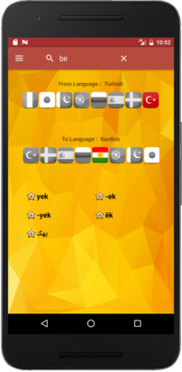
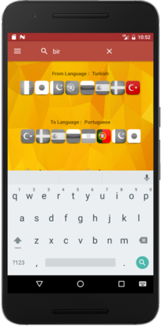
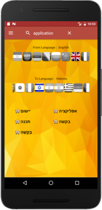
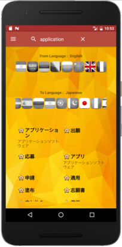
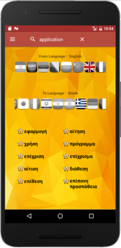
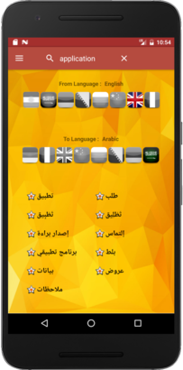
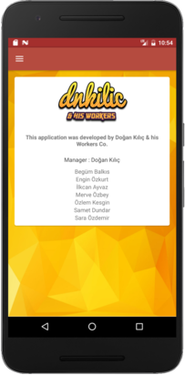

# Global Dictionary
This application is created by a group of student who finished Learn Android in 32 Days course.

Features
--------

Cross translation between 21 languages.

Supported Languages
--------

ARABIC("ar"), ARMENIAN("hy"), BOSNIAN("bs"), BULGARIAN("bg"), CHINESE("zh"),FRENCH("fr"), GERMAN("de"), GREEK("el"), HINDI("hi"), PERSIAN("fa"), HEBREW("he"), ITALIAN("it"), JAPANESE("ja"), URDU("ur"), PORTUGUESE("pt"), RUSSIAN("ru"), SPANISH("es"), SWEDISH("sv"), TURKISH("tr"), ENGLISH("en"), KURDISH("ku").

Screenshots
--------

      

      

Developers
--------
Begüm Balkıs

Engin Özkurt

İlkcan Ayvaz

Merve Özbey

Özlem Kesgin

Samet Dundar

Sara Özdemir
